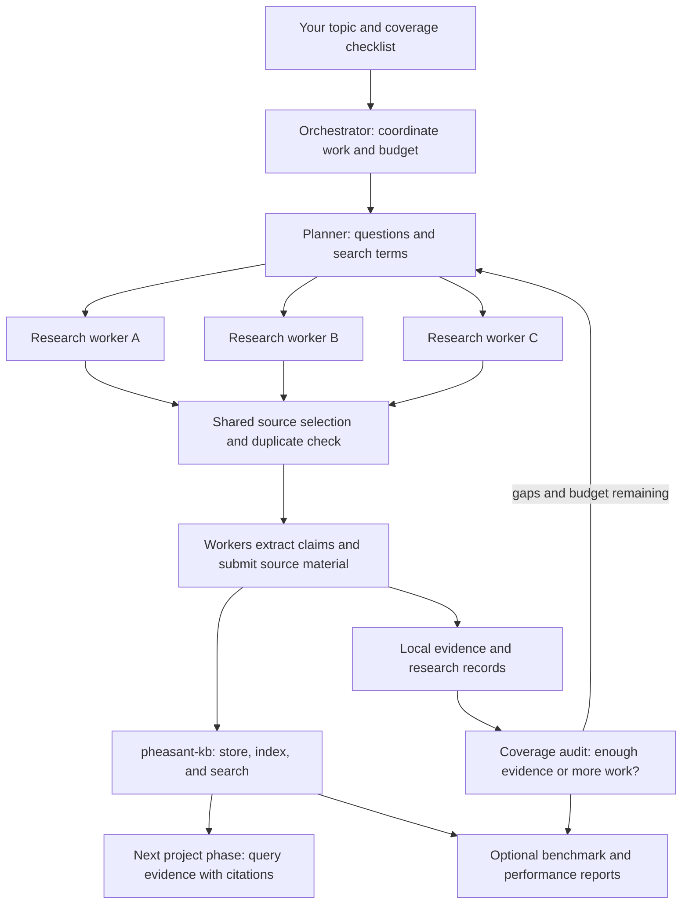

# Pheasant Swarm Search

**A research swarm that turns a topic into a searchable knowledge base for the
next phase of your project.** A planner divides the topic into research
questions, workers search in parallel, and a coverage auditor identifies gaps.
The swarm saves source material in
[pheasant-kb](https://github.com/esatt10/pheasant-kb), so you or a fresh agent can
use the evidence later to plan an experiment, write a proposal, or build a product.
When you run the optional evaluation, its frozen research questions are saved as
Pheasant memories after scoring, leaving a durable list of what the knowledge
base was expected to serve without storing answer keys there.

The lab runs on your laptop. Live research connects to literature providers, a
model API, and your Pheasant instance. An included offline demo lets you try the
whole workflow without accounts, API keys, or paid calls.

## How the swarm works

Think of a small research team: one person divides the work, several investigate
different questions, and a reviewer checks what is still missing. Here those
roles are coordinated by a Python program with limits on time, cost, and work.



| Part | What it does | Why it matters |
|---|---|---|
| Orchestrator | Schedules bounded research rounds and checks stopping conditions. | Keeps work within a declared budget and records why it stopped. |
| Planner | Divides your topic into subtopics and expands search vocabulary. | Different terms can uncover different parts of the literature. |
| Research workers | Search providers, extract claims from abstracts, and submit source records. | Several questions can be investigated at once. |
| Shared source registry | Selects sources in a fixed order and detects duplicates. | Workers can find the same paper without storing it twice or letting timing decide who gets it. |
| Coverage auditor | Counts evidence for each part of your topic and flags gaps or disagreements. | Many sources do not automatically mean the important questions were covered. |
| Pheasant | Stores and indexes source material for later retrieval. | Knowledge remains usable after the research agents finish. |

Discovery runs in parallel, source selection runs sequentially with branches
taking turns, and extraction and submission run in parallel again. The auditor's
counts and the final stop decision are computed in code; a model can explain
the audit in words. See the [architecture guide](docs/architecture.md) for the
implementation, settings, and data flow.

## What can I research?

You can define scientific topics such as battery degradation, or non-scientific
project questions such as employee onboarding, education, or organizational
decision-making. **The built-in discovery providers search scholarly literature:**
OpenAlex, Crossref, arXiv, and PubMed. For a business or social topic, this means
research papers about that subject.

General web search, news search, and automatic discovery of company pages are
not implemented in this swarm. Pheasant itself can index documents, websites,
and other sources you supply. The [topic guide](docs/topics.md) explains both
paths, with scientific and non-scientific examples.

Currently, the swarm submits **source metadata and abstracts as Markdown**.
Extracted claims and disagreements stay in the local research record. It does
not automatically download full papers or build your next project deliverable.

## Start with the free demo

You need Git and [uv](https://docs.astral.sh/uv/getting-started/installation/).
Open a terminal: PowerShell on Windows, or Terminal on macOS/Linux. These
commands work in either shell:

```text
git clone https://github.com/esatt10/pheasant-swarm-search.git
cd pheasant-swarm-search
uv python install 3.12
uv sync --extra dev --python 3.12
uv run pheasant-lab demo --config configs/demo.yaml
```

If you already have this checkout open, start with `uv python install 3.12` in
its root folder. Installation downloads dependencies; the demo itself uses
synthetic literature, a simulated Pheasant server, and a deterministic model.
Its scores describe those demo components.

The last output includes `demo run: run-...`. Open
`runs/<that-run-id>/reports/summary.md`, then `collection.md` in the same folder.
`INCOMPLETE` means some checks lack evidence; a nonzero exit can accompany useful
demo output. See [setup and troubleshooting](docs/setup.md) for installation
help and how to read the result.

To test **real Pheasant with no model**, start Docker and run:

```text
docker compose -f deploy/stub/compose.yaml up -d --wait
uv run python scripts/check_pheasant_setup.py
```

This uses fixture documents and replay models, verifies storage and retrieval,
and runs all five comparison arms. Open Pheasant at <http://127.0.0.1:8766>.
See [the no-model setup walkthrough](docs/setup.md#2b-test-real-pheasant-without-a-model)
for expected output, logs, and how to stop and restart it.

## Build a knowledge base for your own project

Follow the [live setup guide](docs/setup.md) once to connect Pheasant, configure
a model and its prices, and create your local topic file. Then the workflow is:

```text
uv run --env-file .env pheasant-lab doctor --config configs/experiment.yaml
uv run --env-file .env pheasant-lab plan --config configs/experiment.yaml --topic topic-onboarding
uv run --env-file .env pheasant-lab collect --config configs/experiment.yaml --topic topic-onboarding
```

`--topic` selects an **ID from your topics file**. The example above uses the
onboarding topic in the [topic guide](docs/topics.md). Each `collect` invocation
handles one topic and prints its run ID. With no `--topic`, it uses the first
topic in the file.

After collection, inspect coverage:

```text
uv run --env-file .env pheasant-lab audit --config configs/experiment.yaml --run RUN_ID
```

Replace `RUN_ID` with the printed `run-...` value. Open Pheasant's web UI or
connect your next agent to its MCP endpoint, select the same knowledge base,
and search the collected evidence. The [handoff example](docs/topics.md#use-the-knowledge-in-your-next-project-phase)
shows a prompt and the exact information to carry forward. You can use the
knowledge base after collection; the benchmark is an additional quality check.

After evaluation, the benchmark questions themselves are available as Pheasant
memories for follow-up work. They are published only after every comparison arm
has answered, and expected facts, matchers, evidence IDs, answers, and scores
remain in the local run artifacts.

## Understand performance without learning the jargon first

The measures answer five separate questions. Read them in this order:

| Question | Plain-language example | Where to look |
|---|---|---|
| **Collection:** did we cover the topic? | Three of four equally weighted areas meet their source minimums: 75% coverage. | `audit`, then `reports/collection.md` after evaluation and reporting |
| **Persistence:** was the material saved and indexed? | A receipt says a document arrived; an index acknowledgment says it became searchable. | `raw/ingest-receipts.jsonl`, reconciliation in `state.json` |
| **Retrieval:** can an agent find useful evidence? | It finds three of four known useful sources in its first ten results: 75% recall at 10. | `metrics/per-query.jsonl` |
| **Answering:** can it answer accurately and cite what it read? | It returns required facts, supports its claims, and uses valid citations. | `reports/arm-comparison.md` |
| **Learning:** do memory and search changes help on new questions? | Improvement on questions used for learning also appears on questions kept aside. | Cohort comparisons and `reports/worst-regressions.md` |

A score of `0` means a measured result was zero. **`insufficient_evidence` with
`value: null` means there was not enough evidence to calculate the score.**
For example, an answer with no citations cannot have a citation-validity rate.

The [performance guide](docs/metrics.md) gives everyday explanations, formulas,
examples, limitations, and the meaning of `PASS`, `FAIL`, and `INCOMPLETE`.
It also explains the five comparison arms and the optional evaluation commands.

## Find your way around

| Path | Contents |
|---|---|
| [docs/setup.md](docs/setup.md) | Installation, live connection, credentials, pricing, and troubleshooting |
| [docs/topics.md](docs/topics.md) | Define a topic, choose coverage areas, search, and hand off the knowledge |
| [docs/architecture.md](docs/architecture.md) | Coordination, source lifecycle, boundaries, and extension points |
| [docs/metrics.md](docs/metrics.md) | Performance measures and interpreting comparisons |
| [configs/](configs/) | Example experiment, topic, model, Pheasant, and evaluation settings |
| [prompts/](prompts/) | Instructions used by the model roles |
| [src/pheasant_lab/](src/pheasant_lab/) | Implementation; package: `pheasant-swarm-lab`, command: `pheasant-lab` |
| [schemas/](schemas/) | Published record formats |
| `runs/` | Local run output, ignored by Git |

For development, after installing the `dev` extra:

```text
uv run ruff check src tests
uv run ruff format --check src tests
uv run python scripts/export_schemas.py --check-clean
uv run pytest
```

These are the checks behind `make check` on systems with Make. Tests stay
offline. Read [CLAUDE.md](CLAUDE.md) before changing implementation invariants.
Credentials in `.env` and run output are ignored by Git; live model and
literature calls still use the external services you configure.

License: [LICENSE](LICENSE).
