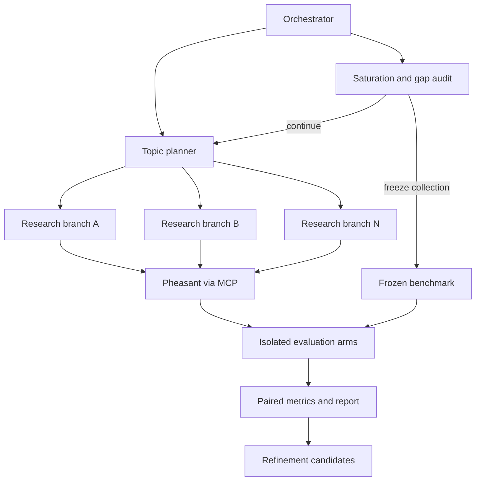

# Pheasant Scientific Swarm Evaluation Lab

Stress-test a [Pheasant](https://github.com/esatt10/pheasant-kb) knowledge
region with hierarchical scientific research swarms, then find out whether a
**fresh agent with nothing but Pheasant** can rival the source-aware specialist
that built the collection.

One laptop. No Kafka, no hosted database, no observability service. A default
run budget of **USD 10.00**, enforced by a guard that reserves before every
call rather than reconciling after.

```bash
./scripts/bootstrap.sh
uv run pheasant-lab demo --config configs/demo.yaml   # offline, free, end to end
```

---

## What this repository is for

It answers five questions and **refuses to blend them into one score**:

| | Question | Where the answer lives |
|---|---|---|
| **Collection** | Did the swarm gather a broad, authoritative, non-redundant, traceable body of literature? | `reports/collection.md` |
| **Persistence** | Did Pheasant receive and index the intended information without silent loss, duplication or scope leakage? | ingest receipts, `reconcile`, the `core` gate set |
| **Retrieval** | Can a stateless agent find the right evidence with no access to the research trace? | `known_positive_recall_at_k`, `negative_exposure_at_k` |
| **Answering** | Can that agent answer a frozen question set as well as the specialist? | `fact_f1`, the non-inferiority decision |
| **Learning** | Do memory and query tuning improve held-out performance, merely repeat learned questions, or cause regressions? | the `learned` / `temporal_holdout` cohort split |

Three things this repository will not do, anywhere, at any threshold:

* call **corpus similarity** truth,
* call **exposure** success,
* call a score computed over **sparse evidence** accuracy — a metric that
  cannot carry its denominator reports `insufficient_evidence` with
  `value: null`, never `0.0`.

---

## The five arms

| ID | Arm | What it may see | What its delta means |
|---|---|---|---|
| `S0` | Source-aware specialist | the collected sources and the research trace | the attainable reference — **not** ground truth; it is scored by the same rules and can be wrong |
| `C0` | Prior-only control | the model's prior, nothing else | separates model knowledge from Pheasant's contribution |
| `P0` | Pheasant corpus baseline | Pheasant search, memory and steering **off** | what the indexed corpus is worth |
| `P1` | Pheasant with memory | the same snapshot, memory and steering **on** | the memory-attributable effect |
| `P2` | Tuned-search replay | first-pass retrieval evidence may tune the query strategy | the query-adaptation effect |

Reported comparisons: `P0 − C0`, `P1 − P0`, `P2 − P1`, `P1 − S0`, `P2 − S0`.

**Isolation is enforced in code, not remembered.** `arms/base.py` declares
what each arm may be constructed with and raises if it is handed anything
else. A Pheasant arm never receives source URLs, the topic plan, the
specialist's notes, the expected answers, another arm's response, or another
arm's tool trace.

### "Rivals the specialist" is not "scored higher"

`P1` or `P2` rivals `S0` only when all six hold:

1. the lower paired confidence bound is no worse than the configured margin;
2. fact precision, evidence support, citation validity and abstention gates pass;
3. no ACL, temporal, stale-memory or leakage gate fails;
4. it holds on the **temporal holdout**, not only on learned replay;
5. cost and latency stay within budget;
6. no protected question type regressed under the mean.

---

## How a run goes



```bash
# Verify the laptop, the models, the providers and the Pheasant capability map.
uv run pheasant-lab doctor --config configs/experiment.yaml

# Project cost without a model or ingest call.
uv run pheasant-lab plan --config configs/experiment.yaml --topic "<topic>"

# Collect and ingest.
uv run pheasant-lab collect --config configs/experiment.yaml --topic "<topic>"

# Audit saturation; then freeze.
uv run pheasant-lab audit --run <run_id>
uv run pheasant-lab freeze-benchmark --run <run_id>

# Run the isolated arms.
uv run pheasant-lab evaluate --run <run_id> --arms S0,C0,P0,P1,P2

# Rebuild every projection from the raw events alone.
uv run pheasant-lab replay --run <run_id>

# Verify hashes, lineage, pairing, leakage and gates.
uv run pheasant-lab verify --run <run_id>

# Render Markdown, CSV and JSON reports.
uv run pheasant-lab report --run <run_id>
```

Every mutating command takes `--resume`, `--dry-run` and `--max-cost-usd`. A
resumed run uses the **original** resolved-configuration digest unless you
pass `--fork`: resuming under a changed configuration produces one run
directory whose halves are not comparable, and nothing downstream could tell.

---

## Collection stops for a reason, and says which

Collection may report `sufficient` only when **every** hard condition passes:
facet minimums (sources, independent families, peer-reviewed counts),
provenance completeness, the ingest receipt rate, critical contradictions
resolved or converted into benchmark uncertainty cases, marginal unique-claim
yield below threshold for the configured window, the evaluation reserve
intact, no unassigned critical gap, and the duplicate rate under its ceiling.

Running out of money or time produces `stopped_budget_incomplete` or
`stopped_time_incomplete`. Those are not failures. Reporting `sufficient` when
they are true would be.

Two things the calculus refuses to conflate:

* **Six papers from one lab are one family.** A source count that looks
  healthy beside a family count of 1 is concentration, not coverage.
* **A declining marginal yield means this search direction is exhausted.** It
  is compatible with having missed the field entirely.

---

## The benchmark is frozen before the first arm runs

`benchmark/` holds `questions.jsonl`, `expected-facts.jsonl`,
`expected-evidence.jsonl`, `exclusions.jsonl`, `abstention-cases.jsonl`,
`cohort-membership.jsonl` and a manifest digesting every one of them. The
frozen files carry **no run stamp**: two runs over the same corpus produce
byte-identical questions, so "the same question in two runs" is the same
question and a trend line exists.

Every required fact carries **its own deterministic matcher**. A fact nobody
can match deterministically is not eligible as an operand and is reported as
an *exclusion* — never as a miss. A miss says the arm failed; an exclusion
says the benchmark could not judge.

Five leakage checks run before evaluation, and an invalidating finding
invalidates the affected comparison until the set is re-frozen:

1. the question's own wording satisfies its expected fact;
2. a question matches a research prompt, a memory record or a tuned alias;
3. a holdout or control question created the treatment it is used to test;
4. an abstention case has retrievable supporting evidence;
5. a benchmark file reached the Pheasant namespace.

Check 3 is the one that matters most: without it, `learned − holdout` stops
being a memorisation detector and becomes a restatement of the learned number.

---

## Every number resolves to its evidence

```text
run → agent span → source discovery → acquisition → source artifact
    → extracted claim → Pheasant ingest request → ingest receipt
    → snapshot/index state → benchmark question → arm/session
    → MCP search call → returned context → answer → answer claim/citation
    → proof event → metric operands → aggregate delta → report statement
```

Raw JSONL is **authoritative and append-only**. The DuckDB file is a
disposable projection rebuilt from it; a projection error never mutates a raw
trace. Corrections supersede — a crossed index barrier appends a new receipt
row rather than editing the old one, and readers fold the file by key.

The acceptance test this repository sets itself, and which
`tests/integration/test_end_to_end.py` walks: a reviewer starts at one sentence
in `summary.md`, resolves it to an aggregate, inspects its per-question values,
locates the exact Pheasant result and ingest receipt, traces that result to its
source and locator, and sees every error and exclusion that touched the
denominator.

### Typed proof

Served, considered, included and **`not_selected`** are *unknown*, weight zero.
A reader may have found the answer at rank one, and treating silence as a
negative manufactures negatives at exactly the rate the region serves results.
Weight is the product of four **reported** multipliers — directness,
independence, specificity, recency — and positive and negative sums never
cancel: `P`, `N`, `Net` and a conflict rate are published separately.

### Gates are not metrics

Gates are evaluated **before** aggregation, so a good score cannot offset a
failed one. A gate set cannot be constructed empty — `all([])` is `True` — and
a verdict is **tri-state**: `PASS` requires that every gate in the set was
*evaluated* and passed. A set with three of four gates skipped reports
`INCOMPLETE (1 of 4 gates evaluated)`, because an unchecked box and a failed
one are equally disqualifying for a result somebody will publish.

---

## Running it against real Pheasant

1. Start Pheasant and note its MCP endpoint.
2. `cp .env.example .env` and fill in `PHEASANT_MCP_URL`, the model provider
   and its key, and the tool names if your build renames any.
3. `uv run pheasant-lab doctor --config configs/experiment.yaml` — it fails
   before any spend when a required capability is missing, a configured tool
   is absent from `tools/list`, a model has no price, or the adapter cannot
   satisfy a tool's advertised schema.

Tool names are **configured, not assumed** (`configs/pheasant-mcp.example.yaml`).
Pheasant's own docs say to read the readiness contract before hard-coding a
tool name; this lab does the equivalent at preflight and refuses rather than
guessing. Heuristic name matching is off by default.

The lab writes to a knowledge base and a source it owns. Use a namespace that
holds nothing else: it submits documents and seals snapshots there.

---

## The offline demo, and what it does not measure

`pheasant-lab demo` runs the whole pipeline with no network, no key and no
cost: fixture literature, an in-process Pheasant-shaped MCP region, and a
deterministic rule-based provider.

It exercises the plumbing — the handshake, capability resolution, ingestion,
the index barrier, the freeze, five arms, the metric engine, the gates, the
projection and every report. It **does not measure Pheasant**, and the reports
say so in their own limitations section:

* the mock region is BM25 over what was submitted, with no vector or graph arm;
* the deterministic provider has **no prior knowledge**, so `C0` abstains
  everywhere and `P0 − C0` is a *floor* on the corpus's contribution rather
  than an estimate of it;
* the fixture corpus is synthetic and says so in its own header. A fixture
  whose known-positives were written by the seeding script would produce
  numbers that measure the seeding script.

A demo run typically ends with `hard_gates: INCOMPLETE` — the ACL and
stale-memory gates have nothing to test in a region with no ACL enforcement and
no superseded records. That is the tri-state working, not a bug: *"nothing is
wrong here"* and *"this is ready to be measured"* are different sentences.

---

## Layout

```text
configs/     experiment, models, metrics, proof policy, MCP map, logging, topics
prompts/     one file per agent role — the part you will most want to edit
schemas/     the shapes an outside reader can rely on; validated in CI
src/pheasant_lab/
  orchestration/  planner, researcher, auditor, stopping calculus, orchestrator
  providers/      OpenAlex, Crossref, arXiv, PubMed, and an offline fixture pack
  pheasant/       MCP protocol, transports, capabilities, ingest, retrieval, mock
  benchmark/      builder, freezer, leakage, question types and matchers
  arms/           S0, C0, P0, P1, P2 and the isolation they enforce
  evaluation/     metric contract, proof, metrics, pairing, statistics, gates
  tracing/        events, spans, errors, lineage, DuckDB projection
  reports/        summary, arm comparison, regressions, refinements
runs/        run output (git-ignored; run content is user data)
```

## Development

```bash
make test     # offline by design; no test reaches the network
make lint
make schemas  # fail if schemas/*.json would change
make check    # everything CI runs
```

## Security, privacy and licensing

`.env`, run content, downloaded papers and raw prompts are git-ignored.
Secrets are resolved at runtime and replaced with a **stable** redaction token
in every trace — stable so a reader can tell that two calls used the same
credential from a trace containing neither. Forbidden headers are dropped
rather than masked. Full text is retrieved only where access and licence
permit; otherwise the record keeps metadata, the abstract and the canonical
locator, and says which it has. Remote telemetry export is opt-in and
configured independently. Refinement candidates are a report artifact by
default; submitting them to Pheasant requires an explicit, separate
diagnostic namespace, because a region that can retrieve its own diagnostics
can answer a question with its own report.

## Licence

See [LICENSE](LICENSE).
